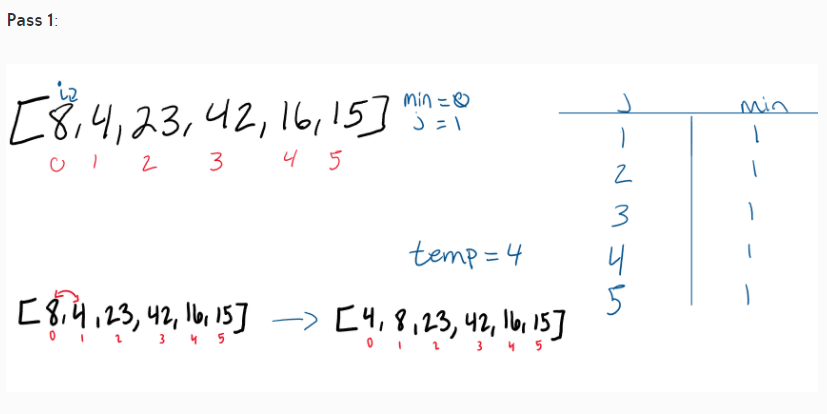
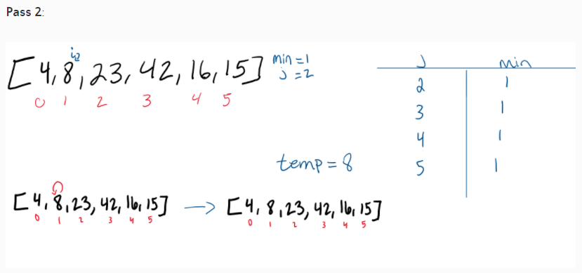
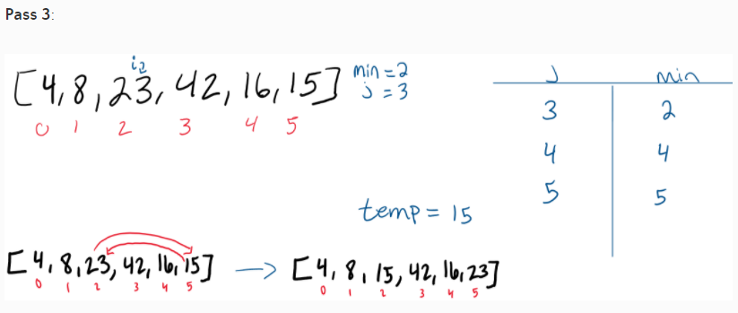
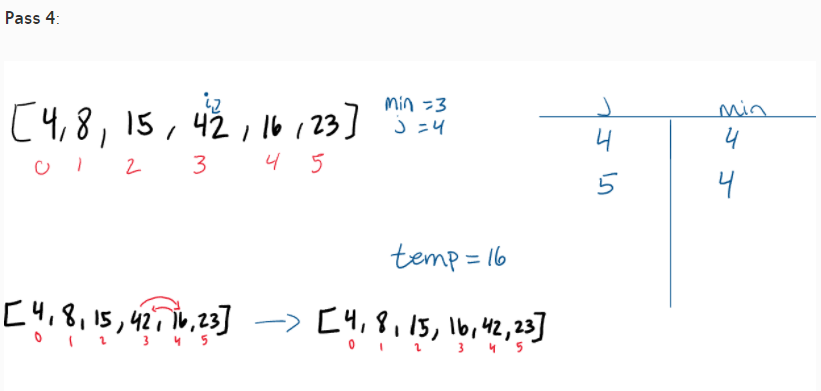
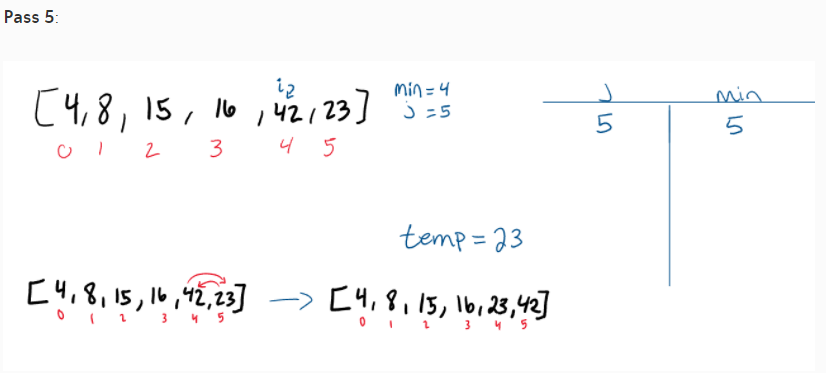
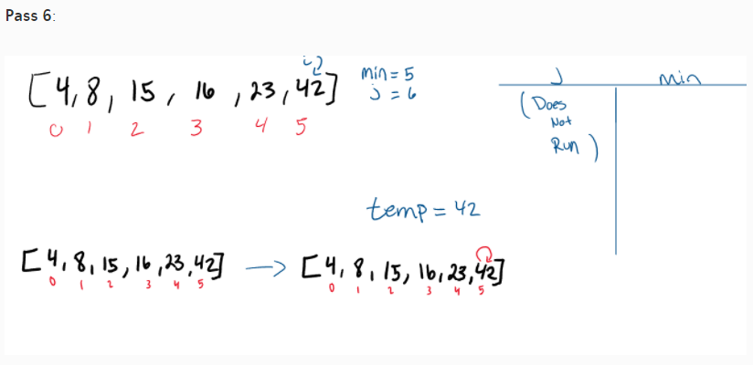

# Insertion sort
Insertion Sort Using insertion sort, sorts array items from least to biggest number.

Pseudocode

InsertionSort(int[] arr)
````
FOR i = 1 to arr.length

int j <-- i - 1
int temp <-- arr[i]

WHILE j >= 0 AND temp < arr[j]
arr[j + 1] <-- arr[j]
j <-- j - 1

arr[j + 1] <-- temp
Trace
Sample Array: [4, 25, 30, 15, 16]
````
## Trace
```
Sample Array: [8,4,23,42,16,15]
```









## Efficency
Big O(n^2) 


