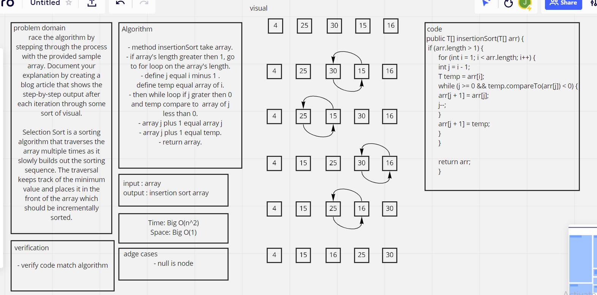

# Challenge Summary
<!-- Description of the challenge -->

Insertion Sort Using insertion sort, sorts array items from least to biggest number.

Pseudocode

InsertionSort(int[] arr)
````
FOR i = 1 to arr.length

int j <-- i - 1
int temp <-- arr[i]

WHILE j >= 0 AND temp < arr[j]
arr[j + 1] <-- arr[j]
j <-- j - 1

arr[j + 1] <-- temp
Trace
Sample Array: [4, 25, 30, 15, 16]
````

## Whiteboard Process
<!-- Embedded whiteboard image -->


## Approach & Efficiency
<!-- What approach did you take? Why? What is the Big O space/time for this approach? -->
Big O(n^2) 

## Solution
<!-- Show how to run your code, and examples of it in action -->

```
 Integer[] array = new Integer[]{8,4,23,42,16,15};
        Sort<Integer> insertionsort = new Sort<>();
        System.out.println(Arrays.toString(insertionsort.insertionSort(array)));
```

result: 
```
[4, 8, 15, 16, 23, 42]
```

## Test

```
 @Test
    public void testInsertionSort() {
        Sort integerSort = new Sort<>();
        assertArrayEquals(new Integer[]{5, 10, 15, 25, 30}, integerSort.insertionSort(integerArr));
    }
```
